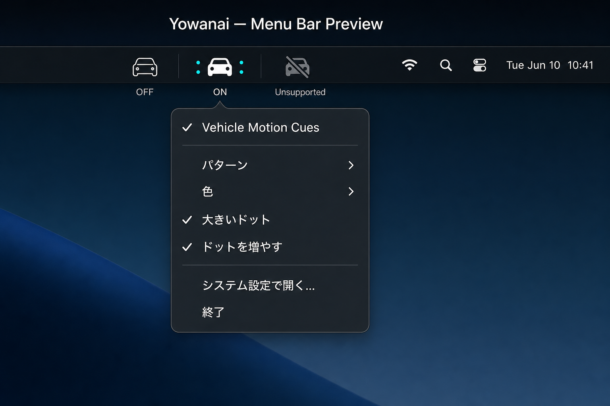
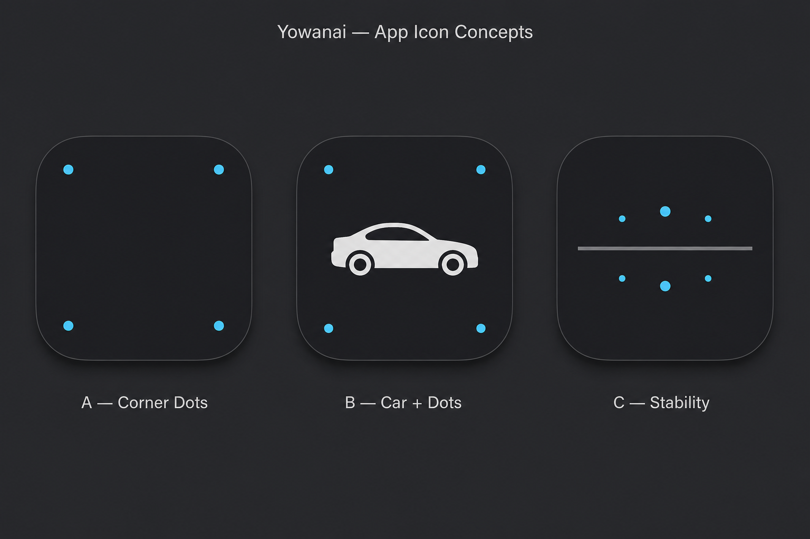

# Yowanai

Menu bar toggle for macOS **Vehicle Motion Cues** — 車酔い対策。

macOS 26 (Tahoe) 以降の **Vehicle Motion Cues**（車両モーションキュー）を、メニューバーから ON/OFF と見た目調整できる軽量ユーティリティ。公式の切り替えは **システム設定 → アクセシビリティ → モーション → Vehicle Motion Cues** と深い階層にあり、Control Center からは ON/OFF のみ。Yowanai はその手前に置く。

## 安全上の注意

**運転中は使用しないでください。** Vehicle Motion Cues は乗客として MacBook を使う場面向けの機能です。運転中の Mac 操作は道路交通法および安全上禁止されています。

## プレビュー

| メニューバー UI | アプリアイコン（採用: B — Car + Dots） |
|-----------------|----------------------------------------|
|  |  |

## ドキュメント

| ファイル | 内容 |
|----------|------|
| [docs/preference-mapping.md](docs/preference-mapping.md) | `com.apple.Accessibility` の preference key と System Settings ラベル対応 |
| [docs/superpowers/specs/2026-06-10-yowanai-design.md](docs/superpowers/specs/2026-06-10-yowanai-design.md) | 製品・技術設計 |

## 前提

- **macOS 26 (Tahoe) 以降**
- **Vehicle Motion Cues 対応の MacBook**（下記「対応ハードウェア」参照）
- 署名なし zip + `install.sh` 配布（Developer ID 署名なし）

## 対応ハードウェア

Apple のドキュメントに基づき、Vehicle Motion Cues は **macOS 26+ の対応 MacBook** で利用可能。次は **非対応**（Yowanai は起動するがメニューが無効化）:

- MacBook Neo
- MacBook Air (M1) およびそれ以前
- 13-inch MacBook Pro (M1) およびそれ以前
- デスクトップ Mac（Mac mini / Mac Studio / Mac Pro / iMac など）

対応判定は `DeviceSupport` が `hw.model` を参照。非対応機ではメニューバーに `car.slash` アイコンと説明ツールチップを表示。

## インストール（配布 zip から）

1. [Releases](https://github.com/kichinosukey/yowanai/releases) から最新の `Yowanai-*-macos-unsigned.zip` を取得
2. zip を展開し、ターミナルで展開フォルダへ移動（例: `cd ~/Downloads/Yowanai-0.1.0`）
3. **次を貼り付けて Enter**（隔離属性除去 + `/Applications` へコピー + 起動）:

```bash
xattr -cr . && bash install.sh
```

`install.sh` は同梱の `Yowanai.app` を `/Applications/Yowanai.app` にコピーして起動する。zip 内の手順は [dist/release/stage/INSTALL.txt](dist/release/stage/INSTALL.txt) にも記載。

ブラウザ経由の zip は Gatekeeper でブロックされることがあります。その場合は上記ターミナル手順を使うか、**システム設定 → プライバシーとセキュリティ** 下部の「このまま開く」を押してください。

`gh` 利用可:

```bash
gh release download --repo kichinosukey/yowanai --pattern '*.zip' -D /tmp/yowanai-install
cd /tmp/yowanai-install && unzip -o *.zip && xattr -cr . && bash install.sh
```

## 使い方

1. メニューバーの **Yowanai**（車アイコン）をクリック
2. **Vehicle Motion Cues** で ON/OFF
3. **パターン** / **色** / **大きいドット** / **ドットを増やす** で見た目を調整（変更は即時反映）
4. **システム設定で開く…** で Accessibility → Motion ペインを開く

Control Center や System Settings で変更した場合、メニューを開き直すと Yowanai の表示が同期される。

## ビルド

```bash
chmod +x scripts/build-app-bundle.sh scripts/install.sh
./scripts/build-app-bundle.sh release
# => dist/Yowanai.app
```

開発用（`.app` バンドルなし）:

```bash
swift build
swift run YowanaiApp
```

ユニットテスト:

```bash
swift test
```

`swift test` は Xcode.app が必要（Command Line Tools のみでは XCTest 不可）。

## リポジトリ構成

```text
yowanai/
  Sources/
    YowanaiCore/     preference 読み書き・デバイス判定
    YowanaiApp/      MenuBarExtra UI
  App/               Info.plist, Icon/
  scripts/           build-app-bundle.sh, install.sh
  docs/              設計・preference mapping・プレビュー画像
  dist/              ビルド成果物（Yowanai.app）
```

## Preference keys

設定は `com.apple.Accessibility` ドメインに書き込む。キーと System Settings ラベルの対応表は **[docs/preference-mapping.md](docs/preference-mapping.md)** を参照。

| UI | Key |
|----|-----|
| Vehicle Motion Cues | `AXSMotionCuesEnabled` |
| Pattern / パターン | `AXSMotionCuesMode` |
| Color / 色 | `AXSMotionCuesTintColor` |
| Larger dots / 大きいドット | `MotionCuesDotSize` |
| More dots / ドットを増やす | `MotionCuesDotDensity` |

## トラブルシュート

| 症状 | 対処 |
|------|------|
| アプリが開けない（Gatekeeper） | **右クリック → 開く**。または **システム設定 → プライバシーとセキュリティ** で許可 |
| 「damaged」/ 開けない（ブラウザ zip） | 展開フォルダで `xattr -cr . && bash install.sh` |
| メニューがすべて無効 | 非対応 Mac または macOS 26 未満。対応ハードウェア・OS を確認 |
| 設定変更が反映されない | メニュー上部のエラーメッセージを確認。System Settings で同項目が変更できるか確認 |
| ドットが出なくなった | `bash scripts/recover-motion-cues.sh` を実行。それでも直らなければ一度ログアウト |
| 二重起動 | 既存インスタンスが前面に来る（単一インスタンス） |

## Manual QA（v0.1.0）

リリース前チェックリスト:

```text
[ ] Toggle ON/OFF from menu bar — dots appear/disappear
[ ] Change pattern, color, larger dots, more dots while ON
[ ] Toggle from Control Center — Yowanai menu matches on reopen
[ ] Second launch activates existing instance
[ ] install.sh copies to /Applications and app launches
[ ] Finder shows motif B app icon
```

## ステータス

- [x] 設計（[docs/superpowers/specs/2026-06-10-yowanai-design.md](docs/superpowers/specs/2026-06-10-yowanai-design.md)）
- [x] YowanaiCore（preference 読み書き・デバイス判定・ユニットテスト）
- [x] MenuBarExtra UI（ON/OFF + 見た目カスタマイズ）
- [x] `.app` バンドル + アイコン + `install.sh`
- [x] v0.1.0 README / manual QA prep

## ライセンス

MIT — 詳細は [LICENSE](LICENSE)。
