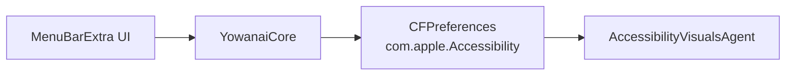

# Yowanai Design

**Date:** 2026-06-10  
**Status:** Approved in brainstorming  
**Project:** `yowanai`  
**Tagline:** Menu bar toggle for macOS Vehicle Motion Cues — 車酔い対策

## Context

macOS 26 (Tahoe) added **Vehicle Motion Cues**, an accessibility feature that displays animated dots on screen to reduce motion sickness while using a MacBook as a passenger in a moving vehicle. The official toggle lives deep in the settings hierarchy:

```text
System Settings → Accessibility → Motion → Vehicle Motion Cues
```

Appearance customization (pattern, color, dot size, density) is one level deeper under **Customize Appearance**.

macOS 26 also exposes Vehicle Motion Cues in Control Center, which can be pinned to the menu bar. That covers ON/OFF only; customization still requires System Settings.

**Yowanai** is a lightweight menu bar utility that puts ON/OFF and appearance controls in one shallow menu.

## Goals

- Toggle Vehicle Motion Cues ON/OFF from the menu bar in one click
- Change appearance settings (pattern, color, larger dots, more dots) from the same menu
- Show current ON/OFF state in the menu bar icon
- Ship as an open-source GitHub project with unsigned zip + `install.sh` distribution (same pattern as `fm-glance`)
- Target macOS 26+ on supported MacBook hardware only

## Non-Goals (v1)

- Keyboard shortcuts
- Login-item / launch-at-startup automation
- Homebrew formula
- App Store or Developer ID signing
- Sandboxed distribution
- Automatic vehicle detection (macOS does not offer an "Automatic" mode on Mac; manual toggle only)

## Supported Hardware

Per Apple documentation, Vehicle Motion Cues is available on Mac laptops running macOS 26+, excluding:

- MacBook Neo
- MacBook Air (M1) and earlier
- 13-inch MacBook Pro (M1) and earlier

Yowanai should detect unsupported hardware and show a disabled menu bar icon with an explanatory tooltip. The app may still launch on unsupported machines for README/testing purposes, but controls remain disabled.

## Architecture

Swift Package Manager project with a core library and a menu bar app target, following the `fm-glance` repo layout.

```text
yowanai/
├── Package.swift
├── Sources/
│   ├── YowanaiCore/
│   │   ├── MotionCuesSettings.swift
│   │   └── DeviceSupport.swift
│   └── YowanaiApp/
│       ├── YowanaiApp.swift
│       └── MenuContent.swift
├── App/Info.plist
├── scripts/
│   ├── build-app-bundle.sh
│   └── install.sh
├── docs/superpowers/specs/
├── README.md
└── LICENSE
```



- **YowanaiApp** owns SwiftUI `MenuBarExtra` and menu layout only
- **YowanaiCore** owns preference read/write, enum mapping, and device support checks
- No direct calls to private frameworks or `AccessibilityVisualsAgent`
- App runs as a menu bar agent (`LSUIElement = true`, no Dock icon)
- App is **not sandboxed** so it can write `com.apple.Accessibility` preferences

## Preference Keys

All settings live in the `com.apple.Accessibility` domain (verified on macOS 27.0):

| UI label (Japanese) | Preference key | Type | Notes |
|---------------------|----------------|------|-------|
| Vehicle Motion Cues | `AXSMotionCuesEnabled` | bool | Master ON/OFF |
| Pattern | `AXSMotionCuesMode` | int | `0` = Regular, `1` = Dynamic; value `2` exists — map labels during implementation by comparing with System Settings |
| Color | `AXSMotionCuesTintColor` | int | `0`–`5`; map color names/swatches during implementation from System Settings |
| Larger dots | `MotionCuesDotSize` | bool | |
| More dots | `MotionCuesDotDensity` | int | `0`–`3`; map labels during implementation from System Settings |

Read/write via `CFPreferences` (`CFPreferencesCopyValue`, `CFPreferencesSetValue`, `CFPreferencesAppSynchronize`). Do not shell out to `defaults` in production code.

`AXSMotionCuesActive` reflects runtime active state; display it optionally in the menu for debugging but do not write to it.

## Menu Bar UI

### Icon

- **ON:** filled car / motion icon (e.g. SF Symbol `car.fill` with visual "active" treatment)
- **OFF:** outline variant
- **Unsupported device:** `car.slash`, grayed out

### Menu structure

```text
Vehicle Motion Cues          [✓]
─────────────────────────────────
パターン              Regular  ›
色                    ● ● ● ● ● ●  ›
大きいドット                  [✓]
ドットを増やす                [✓]
─────────────────────────────────
システム設定で開く…
終了
```

- Master toggle flips `AXSMotionCuesEnabled`
- Submenus for pattern and color; checkmarks for boolean options
- Changes apply immediately on selection (no Apply button)
- **システム設定で開く…** opens System Settings to Accessibility → Motion; use `x-apple.systempreferences:` URL if available, otherwise open Accessibility pane
- **終了** quits the app

### State sync

Reload preferences each time the menu opens. This keeps the UI consistent when the user toggles via Control Center or System Settings while Yowanai is running.

## Components

### `MotionCuesSettings`

- `struct` or class exposing typed properties: `isEnabled`, `pattern`, `tintColor`, `largerDots`, `dotDensity`
- `load()` reads from `com.apple.Accessibility`
- `save()` writes changed keys and synchronizes
- Enum types: `Pattern`, `TintColor`, `DotDensity` with failable or validated raw-value mapping

### `DeviceSupport`

- `static var isSupported: Bool`
- Checks macOS 26+ and excludes known unsupported models (use `sysctlbyname("hw.model", ...)`)
- Maintain explicit blocklist aligned with Apple docs; default to enabled on unknown Apple Silicon MacBook models

### `YowanaiApp`

- `@main` entry, `MenuBarExtra` with `.menuBarExtraStyle(.menu)`
- Single-instance guard: if another instance is running, activate it and terminate the new launch

## Data Flow

**Toggle ON/OFF**

1. User clicks master toggle
2. Core flips `AXSMotionCuesEnabled` and synchronizes
3. Menu bar icon updates
4. System applies change via existing accessibility infrastructure

**Customize appearance**

1. User picks a submenu item or toggles a checkbox
2. Core writes the corresponding key immediately
3. If cues are enabled, dots update on screen without restart

## Error Handling

| Situation | Behavior |
|-----------|----------|
| Preference write fails | Show inline warning text at top of menu; revert UI to last known good state |
| Unsupported hardware | Disabled icon + tooltip; menu items disabled |
| macOS below 26 | One-time alert on first launch; app stays resident with disabled controls |
| Second instance launched | Activate existing instance and exit |

## Testing

**Unit tests (`YowanaiCoreTests`)**

- Enum raw-value mapping for `Pattern`, `TintColor`, `DotDensity`
- `DeviceSupport` blocklist / allowlist logic with injected model identifiers
- Settings round-trip using injectable preference backend (protocol wrapping CFPreferences) so tests do not mutate live system settings

**Manual QA**

- Toggle ON/OFF; confirm dots appear/disappear
- Change each appearance setting while ON; confirm visual update
- Toggle via Control Center; open Yowanai menu; confirm UI matches
- Install from release zip via `install.sh` on a clean folder
- Verify behavior on supported vs unsupported hardware if available

No UI automation tests in v1.

## Distribution

Same unsigned release flow as `fm-glance`:

1. `scripts/build-app-bundle.sh release`
2. Zip `Yowanai.app`
3. Attach to GitHub Release with `install.sh` and `INSTALL.txt`
4. README instructions: `xattr -cr . && bash install.sh`
5. Ad-hoc codesign in build script (`codesign --sign -`)

App bundle name: **Yowanai.app**  
Binary/menu bar name: **Yowanai**  
Repository name: **yowanai**

## Risks and Mitigations

| Risk | Mitigation |
|------|------------|
| Preference keys change in future macOS | Document keys in README; centralize in `MotionCuesSettings`; add manual QA step on OS upgrades |
| Writing prefs may require Full Disk Access in some environments | Test on clean install; document troubleshooting in README |
| Enum label mapping unknown until UI inspection | First implementation task: open System Settings, record label ↔ integer mapping |
| Apple adds official shallow toggle making app redundant | Acceptable; Yowanai still wins on customization from menu bar |

## Open Questions Resolved

| Question | Decision |
|----------|----------|
| Scope | ON/OFF + appearance customization |
| Audience | Personal + GitHub open source |
| Distribution | zip + `install.sh` |
| Shortcuts | Not in v1 |
| Name | **yowanai** (display: Yowanai) |
